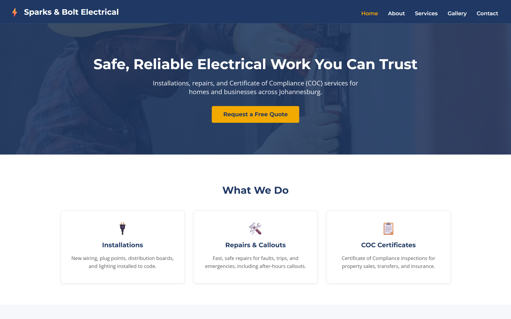
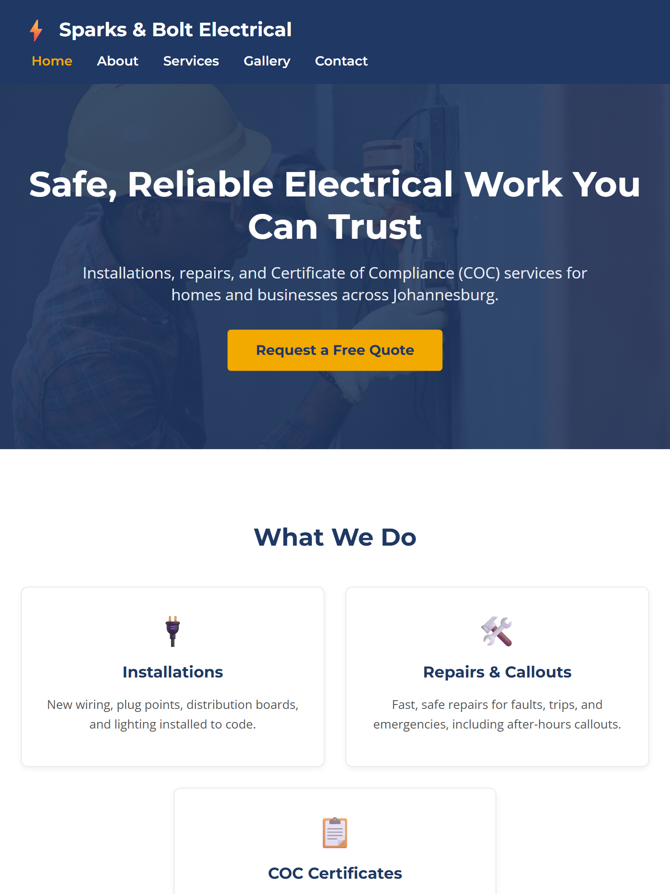
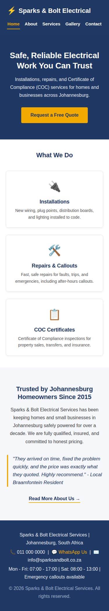

# Sparks & Bolt Electrical Services — Website Project

Web Development POE (WEDE5020)
Student: Roby | Student Number: ST10480499

 ## Live Site\n\n🔗 https://resplendent-dieffenbachia-164bf0.netlify.app\n\n

## About This Project

Website for **Sparks & Bolt Electrical Services**, a hypothetical small electrical
contracting business based in Johannesburg, South Africa.

- **Part 1:** HTML structure, inline CSS only, project planning and proposal.
- **Part 2 (current):** External CSS styling for a desktop solution, plus responsive design across desktop, tablet, and mobile breakpoints.
- **Part 3 (upcoming):** JavaScript functionality, form validation, SEO, and external service integration.

## File and Folder Structure

sparks-and-bolt/
- index.html (Homepage)
- css/
  - style.css (Single external stylesheet, linked from every page)
- pages/
  - about.html
  - services.html
  - gallery.html
  - contact.html
- assets/
  - screenshots/ (Responsive testing screenshots: desktop, tablet, mobile)
- docs/
  - Proposal_1_Sparks_and_Bolt_Electrical.docx
  - Proposal_2_Braamfontein_Bake_House.docx
- README.md

## 1. Working Through Feedback from Part 1

Part 1 feedback stated that several criteria were not met: no file/folder structure,
no semantic HTML5 tags, no page content, no navigation menu, and no code comments.

These items were queried directly with the lecturer, since the submitted GitHub
repository (public, and confirmed independently to be accessible) already contained
all of these elements at the time of marking - a folder structure (pages/, docs/,
assets/), semantic tags (header, nav, main, section, footer) throughout every page,
full written content on every page, a working navigation menu linking all five
pages, and HTML comments labelling each section. This query is on record with the
module lecturer. No structural corrections were required for these specific items,
as they were already present and correct.

The feedback that was genuinely actionable has been addressed in this Part 2 update:

- Commit messages: more descriptive commit messages are being used going forward.
- README detail: this document has been substantially expanded (see below).
- Changelog detail: entries now include more specific descriptions of what changed and why.
- References: additional references have been added, covering the techniques used in Part 2.
- Content depth: page content has been reviewed and kept fully aligned with the site's purpose.

## 2. CSS Styling for Desktop Solution

All styling has been moved into a single external stylesheet (css/style.css),
linked from every page. Key decisions:

- Base style / reset: a universal box-sizing reset, consistent base font size
  (1rem = 16px), and sensible defaults for margin, padding, links, and lists.
- Typography scale: headings (h1-h3) and body text follow a consistent scale
  based on rem units, using Montserrat for headings and Open Sans for body text,
  so the visual hierarchy stays consistent across every page.
- Layout: CSS Grid is used for the service cards, gallery grid, and the contact
  page's two-column layout; Flexbox is used for the header and navigation bar. The
  cascading nature of CSS is used throughout - shared rules (e.g. button styles,
  heading styles) are defined once and reused across every page rather than repeated.
- Visual styles: colour, background-color, border-radius, and box-shadow are used
  for cards and buttons, with :hover and :focus states added on links, buttons,
  and form fields for better interactivity and accessibility.

## 3. Responsive Design

The site is styled desktop-first, with two breakpoints stepping the layout down:

- Tablet (max-width: 900px): service cards and gallery images move from 3 columns
  to 2, and the contact page's two-column layout becomes a single column.
- Mobile (max-width: 600px): the header stacks vertically, service cards and
  gallery images move to a single column, and heading sizes reduce slightly to suit
  smaller screens.

Relative units (rem, em, %) are used throughout instead of fixed pixel values,
so the layout scales properly across screen sizes. The gallery page uses srcset
and sizes on every image, serving a smaller image file to smaller screens rather
than forcing mobile users to download a full-size desktop image. The homepage hero
background image also swaps to a smaller file size at the mobile breakpoint.

### Responsive Testing

The website was tested using real browser rendering at three breakpoints, matching
the site's own CSS breakpoints: 1440px (desktop), 768px (tablet, iPad-width), and
375px (mobile, standard phone width).

#### Desktop (1440px)

#### Tablet (768px)

#### Mobile (375px)

At each width, the service cards, navigation, and overall layout were confirmed to
reflow correctly according to the breakpoints defined in css/style.css.

## How to View the Site

Open index.html in any modern web browser, or use a local server (e.g. VS Code's
Live Server extension) for the most accurate preview. An internet connection is
required for the Google Fonts, Unsplash images, and the embedded Google Map to load.

## Changelog

### v2.0.0 — 17 September 2026
- Extracted all inline CSS from Part 1 into a single external stylesheet (css/style.css), linked from every page.
- Implemented a consistent base style and typography scale using rem units.
- Rebuilt page layouts using CSS Grid (service cards, gallery, contact page) and Flexbox (header, navigation).
- Added :hover and :focus states to links, buttons, and form fields.
- Added two responsive breakpoints (900px tablet, 600px mobile) with layout, typography, and spacing adjustments at each.
- Converted all sizing to relative units (rem, em, %) instead of fixed pixels.
- Added srcset/sizes to all gallery images and a smaller mobile-specific hero background image for responsive image loading.
- Captured and added new responsive testing screenshots (desktop, tablet, mobile) to this README.
- Reviewed Part 1 feedback; queried inaccurate criteria directly with the lecturer (see Section 1 above); addressed all genuinely actionable feedback (commit detail, README detail, changelog detail, references).
- Fixed a repeated nested-folder structure issue in the repository.

### v1.1.0 — 12 August 2026
- Fixed nested folder structure in the repository.
- Added responsive testing screenshots (desktop, tablet, mobile) and a Responsive Testing section to this README.

### v1.0.0 — 9 August 2026
- Initial project setup and folder structure created.
- Website Project Proposals drafted and submitted for lecturer approval (two organisations).
- Built homepage (index.html) with header, navigation, hero section, service highlights, and footer.
- Built about.html, services.html, gallery.html, and contact.html with full inline CSS styling.
- Added consistent navigation and footer across all pages.
- Added contact form markup on contact.html (validation to be added with JavaScript in Part 3).

## References

- Unsplash (2026) Free stock photos. Available at: https://unsplash.com (Accessed: 9 August 2026).
- Google Fonts (2026) Montserrat and Open Sans. Available at: https://fonts.google.com (Accessed: 9 August 2026).
- Mozilla Developer Network (2026) CSS Grid Layout. Available at: https://developer.mozilla.org/en-US/docs/Web/CSS/CSS_grid_layout (Accessed: 17 September 2026).
- Mozilla Developer Network (2026) Flexbox. Available at: https://developer.mozilla.org/en-US/docs/Web/CSS/CSS_flexible_box_layout (Accessed: 17 September 2026).
- Mozilla Developer Network (2026) Using media queries. Available at: https://developer.mozilla.org/en-US/docs/Web/CSS/CSS_media_queries/Using_media_queries (Accessed: 17 September 2026).
- Mozilla Developer Network (2026) Responsive images (srcset and sizes). Available at: https://developer.mozilla.org/en-US/docs/Web/HTML/Guides/Responsive_images (Accessed: 17 September 2026).
- Mozilla Developer Network (2026) CSS values and units. Available at: https://developer.mozilla.org/en-US/docs/Web/CSS/CSS_Values_and_Units (Accessed: 17 September 2026).
- Department of Employment and Labour (2026) Electrical Installation Regulations and Certificate of Compliance requirements. Available at: https://www.labour.gov.za (Accessed: 9 August 2026).
- Google Maps (2026) Embed a map. Available at: https://www.google.com/maps (Accessed: 9 August 2026).